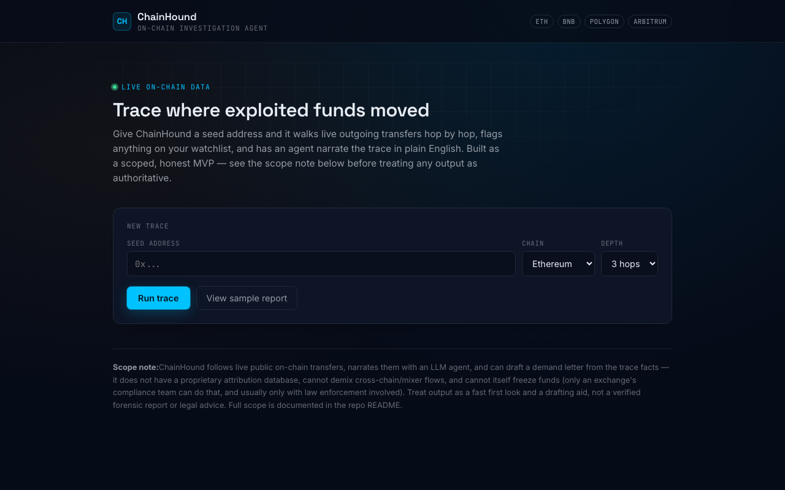

# TraceHound

**Live:** https://tracehound.vercel.app



Agentic on-chain hack tracer, built for the gap institutional vendors (Chainalysis, TRM Labs, Elliptic) leave open: individual cases too small for those vendors to prioritize, too niche for FBI to move fast on. Built from experience working with FBI and U.S. Secret Service on a hack + tracking/referring $6M of crypto crime.

Give it a seed address (e.g. an exploited contract or a hacker's wallet), and it:

1. Walks live outgoing transfers N hops out using the real Etherscan v2 API (works across
   Ethereum, BNB Chain, Polygon, Arbitrum — anywhere Etherscan's unified API covers), rendered as
   a radial hop-by-hop graph (seed at center, watchlist hits highlighted) alongside a full table.
2. Flags any address on the watchlist (`data/watchlist.json`) — populated with **real, current
   OFAC SDN-sanctioned digital currency addresses** (105 as of this writing, EVM-format only:
   ETH/ARB/BSC/USDC/USDT-on-EVM), pulled directly from the U.S. Treasury's official SDN list.
   Refresh it any time with `npm run update-watchlist`.
3. Has an LLM agent narrate the trace in plain English — this narration step, not the hop-walk,
   is the actual differentiator over clicking through a block explorer by hand.
4. Looks up each address's **verified smart contract name** (free, via Etherscan's official
   `getsourcecode` endpoint) — e.g. flagging that a hop went to `UniswapV2Router02`, not a
   person's wallet. This is deliberately different from exchange/mixer attribution: it's an
   objective fact ("this address is a verified contract named X"), not a guess about ownership.
5. Can draft a demand/freeze-request letter from the real trace facts (loss amount + optional
   FBI IC3 complaint number), for victims whose case is too small for a Chainalysis/TRM-tier
   vendor to prioritize. It never claims a specific exchange relationship, never claims the
   letter itself can compel a freeze, and always tells the victim to file with IC3 regardless.

## What this is not

Read this before treating any output as authoritative:

- **No mixer/exchange attribution database.** The watchlist has real OFAC sanctions data (see
  above), but it does not know which addresses belong to mixers or exchanges — that data set is
  most of what Chainalysis, TRM Labs, and Elliptic actually sell, built over years from
  subpoenas and law-enforcement cooperation. Community datasets exist if you want to extend it:
  https://github.com/OffcierCia/On-Chain-Investigations-Tools-List
- **No freezing capability.** Only an exchange's compliance team can freeze funds, and generally
  only with law enforcement legal process behind it. This tool drafts the letter from real trace
  facts; it never sends it, never claims an exchange relationship, and never guarantees a hold.
- **No cross-chain bridge/mixer demixing.** Following funds through a bridge or a mixer like
  Tornado Cash requires dedicated heuristics this MVP doesn't implement.
- **Not court-admissible chain of custody.** No cryptographic proof of data integrity, no expert
  witness track record.

What it's honest about being: a real, functional first-hop tracer with an autonomous narration
layer, useful for a fast first look at where funds moved — not a regulatory-grade investigation
platform.

## Setup

```bash
npm install
cp .env.example .env.local
# fill in ETHERSCAN_API_KEY (free, https://etherscan.io/apis)
# fill in ANTHROPIC_API_KEY (https://console.anthropic.com/)
npm run dev
```

Open http://localhost:3000, paste an address, pick a chain and hop depth, and trace.

## Architecture

```
src/
  app/
    page.tsx              UI: address form, results, narrative
    api/trace/route.ts    server-side chain walk (keeps API keys off the client)
    api/narrate/route.ts  LLM narration of the trace graph
    api/draft-letter/     LLM-drafted demand/freeze-request letter from trace facts
  lib/
    etherscan.ts           Etherscan v2 API client (tx history + verified-contract lookup)
    trace.ts               BFS outward walk, fan-out capping, watchlist + contract enrichment
    watchlist.ts            watchlist lookup
  components/
    TraceGraphView.tsx      radial SVG hop graph (hand-rolled, no charting library)
scripts/
  update-watchlist.js      pulls the real OFAC SDN advanced XML and refreshes watchlist.json
data/
  watchlist.json           known-address list — burn/zero + real OFAC-sanctioned addresses
```

## Roadmap ideas (not built — future scope)

- Incoming-transfer tracing (where funds *came from*), not just outward.
- Bridge-hop following.
- Persistent case storage so a trace can be revisited/exported as a report (PDF).
